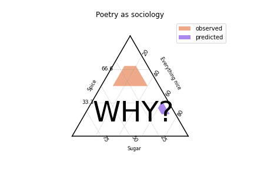

# SoilTriangle
Soil Ternary Plots for soil texture representation - Python3 


Updating the source code [TernaryPlotPy](https://github.com/chlewissoil/TernaryPlotPy) for Python version 3

Examples in `SoilTriangle.ipynb`

## Input soil data

To generate plots and classify soil user should prepare `csv` file, example [triangleplot_demo.csv](triangleplot_demo.csv):

|   | sand | silt | clay | porosity | om |   site |
|--:|-----:|-----:|-----:|---------:|---:|-------:|
| 0 | 20   | 20   | 60   | 34       | 74 | 'ERTQ' |
| 1 | 20   | 50   | 30   | 20       | 2  | 'ASE1' |
| 2 | 0    | 50   | 50   | 54       | 6  | 'PEAT' |
| 3 | 70   | 10   | 20   | 45       | 3  | 'PRPA' |


## Examples

```
stp = SoilTrianglePlot('The soil texture classes') # Argument is the plot title
stp.soil_categories() #Draws the boundaries of sandy loam, etc.
stp.scatter(data, s=weights, c=colors, label='_', cmap = cm.autumn, alpha=0.60, marker='d') #scatter doesn't work well with legend, so label="_" (hides it); cmap chooses the color scheme; alpha allows some transparency to see overlapping data
stp.colorbar('porosity')
stp.line((75,25,0),(0, 67, 33), 'g', label='model 1', linewidth=3) 
stp.line((12,80,8), (0,12,88), 'b', label='model 2', linewidth=3)
stp.show('triangleplot_gaudy') # is also saved to file of <argument> name
```

## Results

